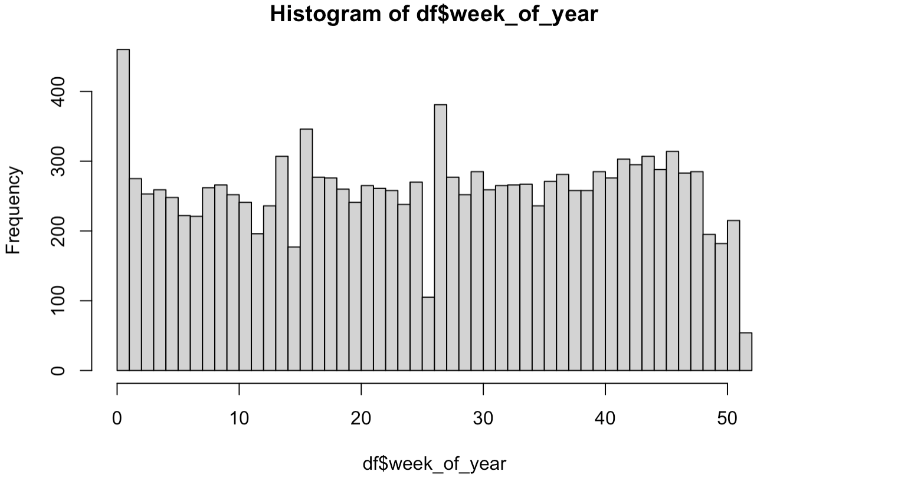
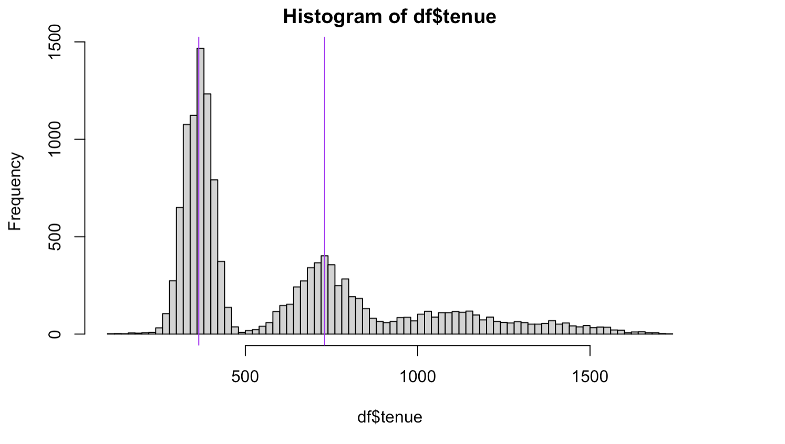
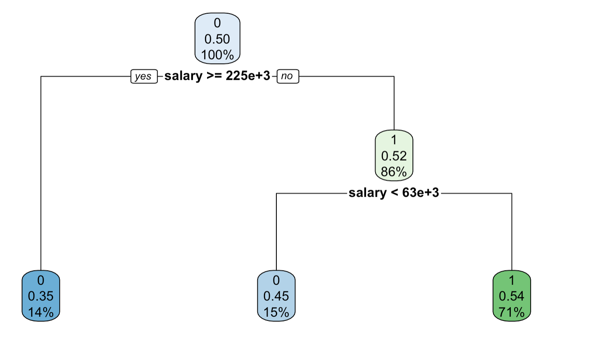

# Data-Challenge-Employee-Retention
People analytics

 

# Goal
Employee turn-over is a very costly problem for companies. The cost of replacing an employee if often larger than 100K USD, taking into account the time spent to interview and find a replacement, placement fees, sign-on bonuses and the loss of productivity for several months.

- 1. Understanding why and when employees are most likely to leave can lead to actions to improve employee retention as well as planning new hiring in advance.

- 2. In this challenge, I have a dataset with information about the employees and have to predict when employees are going to quit by understanding the **main drivers** of employee churn.

# Description
I got employee data from a few companies. I have data about all employees who joined from 2011/01/24 to 2015/12/13. For each employee, I also know if they are still at the company as of 2015/12/13 or they have quit. Aside from that, I have general information about the employee, such as average salary during her tenure, department, and years of experience.

As said above, the goal is to predict employee retention and understand its main drivers. Specifically, I have to :
Assume, for each company, that the headcount starts from zero on 2011/01/23.  
Estimate employee headcount, for each company, on each day, from 2011/01/24 to 2015/12/13. `That is, if by 2012/03/02 2000 people have joined company 1 and 1000 of them have already quit, then company headcount on 2012/03/02 for company 1 would be 1000. `

I have created a table with 3 columns: day, employee_headcount, company_id.

# Research Questions 
What are the main factors that drive employee churn?  
Do they make sense? Explain the findings. 
If I could add to this data set just one variable that could help explain employee churn, what would that be?

# Conclusions

1. Given how important is salary, i would definitely love to have as a variable the salary the employee who quit was offered in the next job. Otherwise, things like : promotion or raises received during the employee tenure would be interesting.

2. The major findings are that employees quit at year anniversaries or at the beginning of the year. Both cases make sense. Even if you don't like your current job, you often stay for 1 year before quitting or you often get stocks after 1 year so it makes sense to wait. Besides, the beginning of the year is well known to be the best time to change job: companies are hiring more and you often want to stay until end of Dec to get the annual bonus

3. Employees with low and high salaries are less likely to quit. Probably because employees with high salaries are satisfied with current status and those with low salaries are less marketable, so they would rather be more stable.
